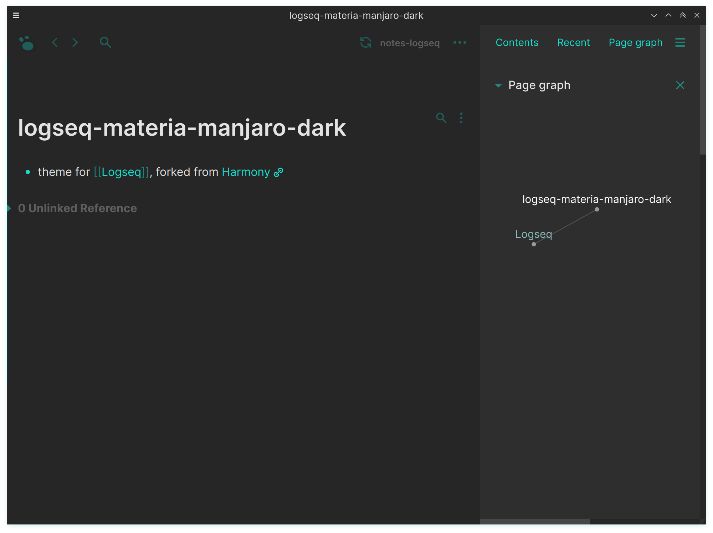

# logseq-materia-manjaro-dark

[Logseq](https://github.com/logseq/logseq) theme. Fork of [DubininDmitry's Harmony theme for logseq](https://github.com/DubininDmitry/Harmony-theme-for-Logseq) to match [freefreeno's Materia Manjaro Dark](https://github.com/freefreeno/Materia-Manjaro-Dark).

Only the dark theme has been changed. I'll figure out what to do with the light theme later.

## todo
- [x] extract colour list from materia theme
- [x] update colours in `custom.css`
- [ ] update fonts
	- [x] sans-serif: [inter](https://rsms.me/inter/)
	- [ ] mono: [liberation mono](https://www.fontsquirrel.com/fonts/Liberation-Mono)
- [ ] reduce number of background colours to 2
	- [ ] add green line borders?

## Installation

> 1. Download `custom.css` file
> 2. Find file `custom.css` in your Logseq repo (in `logseq` folder) and replace with downloaded file
